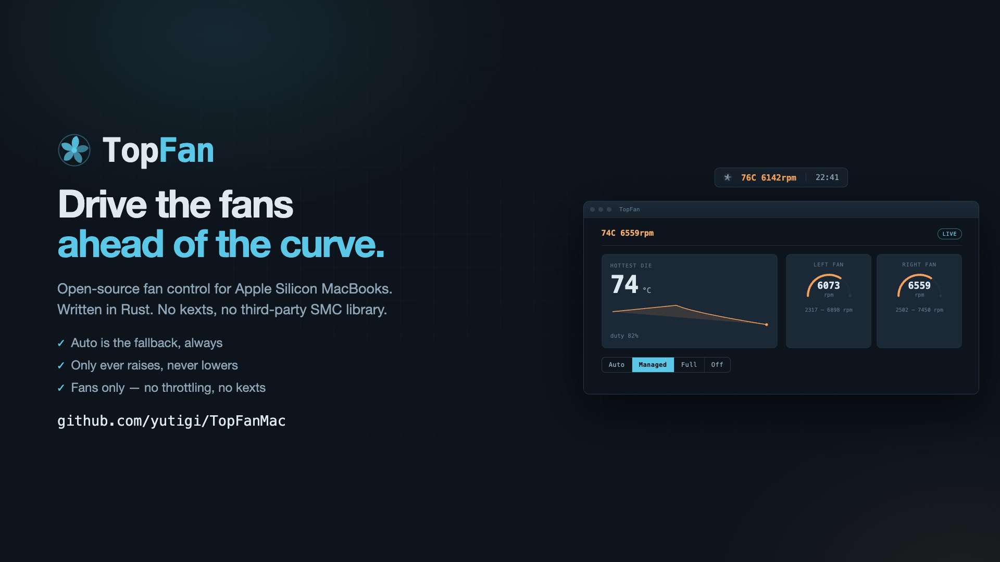

# TopFan

[](https://github.com/yutigi/TopFanMac/actions/workflows/ci.yml)



Fan control for Apple Silicon MacBooks, in Rust. TopFan drives the fans ahead of
macOS's own thermal curve so the machine stays cool under sustained load instead
of heat-soaking first — and it can pin both fans to maximum on demand.

Tested on a MacBook Pro 14" (M3 Max, `Mac15,8`) running macOS 26.5. It speaks the
classic SMC key protocol via IOKit and works with the two-fan layout `FNum`
reports; it has **not** been tested on Intel Macs or other models.

## How it works

Three cooperating pieces, split so that only one touches the hardware:

| Piece | Binary | Privileges | Role |
|---|---|---|---|
| Daemon | `fand` | root | Samples die temperature every second, computes a duty, and drives the fans over the SMC. Owns all hardware access. |
| CLI | `topfan` | unprivileged | Talks to the daemon over a local socket (`status`, `auto`, `full`, `off`). |
| Menu bar | `menubar` | unprivileged | GUI: a status item with live temps/RPM, a fan-mode menu, and a dashboard window. |

The daemon's governor is pure logic — no IOKit, no clock — so the control policy
is fully tested off-device with mock fans. Fan targets are clamped to each fan's
own reported `F0Mn`/`F0Mx` bounds (the two fans have different ranges) and can
only ever *raise* speed above the fan's current RPM, never lower it.

### Safety model

This tool writes to thermal hardware on your only machine, so it errs toward
giving control back:

- **Auto is the fallback, always.** On startup `fand` restores SMC-managed auto
  mode before doing anything else, and launchd `KeepAlive` restarts it if it
  dies — so even a `SIGKILL` leaves the next boot's first act as a restore.
- **Only ever raise, never lower.** Every target is clamped to at least the
  fan's current actual RPM.
- `off` hands the fans back to macOS immediately.
- Fans only — no thermal throttling or power-limit changes.

> **Write path status:** reads are verified working unprivileged; the SMC
> **write** path (`full`/`off` mode changes) is implemented but not yet
> verified against hardware. Run `sudo topfan full` the first time
> deliberately, watching `topfan status`.

## Install

Download the latest `TopFan-<version>-arm64.dmg` from
[Releases](https://github.com/yutigi/TopFanMac/releases), open it, and drag
**TopFan.app** onto **Applications**. Then install the fan-control daemon:

```sh
sudo /Applications/TopFan.app/Contents/Resources/install-daemon.sh
```

That second step is the one that enables fan control, because only the root
daemon is allowed to touch the SMC. Without it the app still runs and shows
live temperature and fan RPM, but the Auto/Managed/Full/Off controls stay
disabled — the app degrades to read-only rather than showing stale numbers.

Releases are not signed with an Apple Developer ID yet, so macOS will say the
developer cannot be verified. Right-click the app and choose Open, or:

```sh
xattr -dr com.apple.quarantine /Applications/TopFan.app
```

To uninstall, run `sudo /Applications/TopFan.app/Contents/Resources/uninstall-daemon.sh`
and drag the app to the Trash. Uninstalling hands the fans back to macOS.

## Building

Requires Rust 1.80+ (see `rust-toolchain.toml`). macOS only — the code uses
IOKit FFI directly, with no third-party SMC library.

```sh
cargo build --release
cargo test          # 48 tests, no root, no hardware, no GUI
```

To build the installer locally, exactly as CI does:

```sh
cargo build --release
./packaging/make-app.sh --version 0.1.0     # -> dist/TopFan.app
./packaging/make-dmg.sh --version 0.1.0     # -> dist/TopFan-0.1.0-arm64.dmg
```

## Usage

### Quick start (GUI)

```sh
cargo run          # launches the menu-bar app
```

You get a status item showing the hottest die temperature and fan speeds, a
menu with **Auto / Managed / Full / Off**, and a dashboard window with live
graphs. Privileged actions are performed by invoking the installed `topfan`
binary via `osascript` with administrator privileges — the app itself never
touches the SMC.

### Daemon + CLI

```sh
# run the daemon in the foreground to try it
sudo ./target/release/fand managed

# from another terminal, unprivileged
./target/release/topfan status    # temps, per-fan RPM/target/bounds/mode
sudo ./target/release/topfan full # pin both fans to maximum (unverified write path)
sudo ./target/release/topfan auto # resume SMC-managed automatic control
sudo ./target/release/topfan off  # hands control back to macOS
```

### Install as a LaunchDaemon

```sh
sudo cp target/release/fand /usr/local/libexec/
sudo cp packaging/com.topfan.fand.plist /Library/LaunchDaemons/
sudo launchctl bootstrap system /Library/LaunchDaemons/com.topfan.fand.plist
```

`sudo launchctl bootout system/com.topfan.fand` removes it. Daemon logs are
visible with `log stream --predicate 'process == "fand"'`.

## Workspace layout

```
crates/
  smc/       IOKit FFI + safe API — all unsafe code lives here.
             hid.rs     thermal sensors via IOHIDEventSystem (verified)
             smc.rs     SMC key protocol for fan read/write
             bin/probe.rs   `smc-probe`: read-only reachability dump
             examples/dump.rs  raw key values + encodings
  fand/      root daemon — governor (pure logic), IPC server, signals
  topfan/    unprivileged CLI client
  menubar/   menu-bar app + dashboard (AppKit/WebKit via objc2)
packaging/   launchd plist
specs/       design specs
```

All `unsafe` is confined to `crates/smc` (plus two documented exceptions in the
daemon). The governor and the menu bar's logic layer are safe and tested
headlessly; the AppKit layer only renders state and forwards clicks.

## Design notes

- **Governor is pure.** A temperature in, a duty out. New control policy belongs
  here, where it can be tested without touching hardware. Response is
  deliberately asymmetric: duty rises immediately but falls only after the
  temperature drops below the last trip point, with hysteresis, so it cannot
  chatter across a curve breakpoint.
- **Daemon is single-threaded** on the control loop; IPC clients are handled
  inline with a 250 ms timeout. Authorization is by peer uid (`getpeereid`),
  so `status` works without sudo while mode changes require root.
- **Honest UI degradation.** If the daemon is unreachable the menu bar shows no
  numbers rather than stale ones; it recovers automatically on the next poll.

## Debugging

```sh
cargo run --bin smc-probe            # what can we reach? (safe, read-only)
cargo run --example dump -p smc      # raw SMC key values + encodings
```

If every SMC key suddenly fails with `result = 137`, check that the read/keyinfo
selectors (5 and 9) aren't swapped — a swapped pair looks exactly like a
permission failure.

## License

MIT