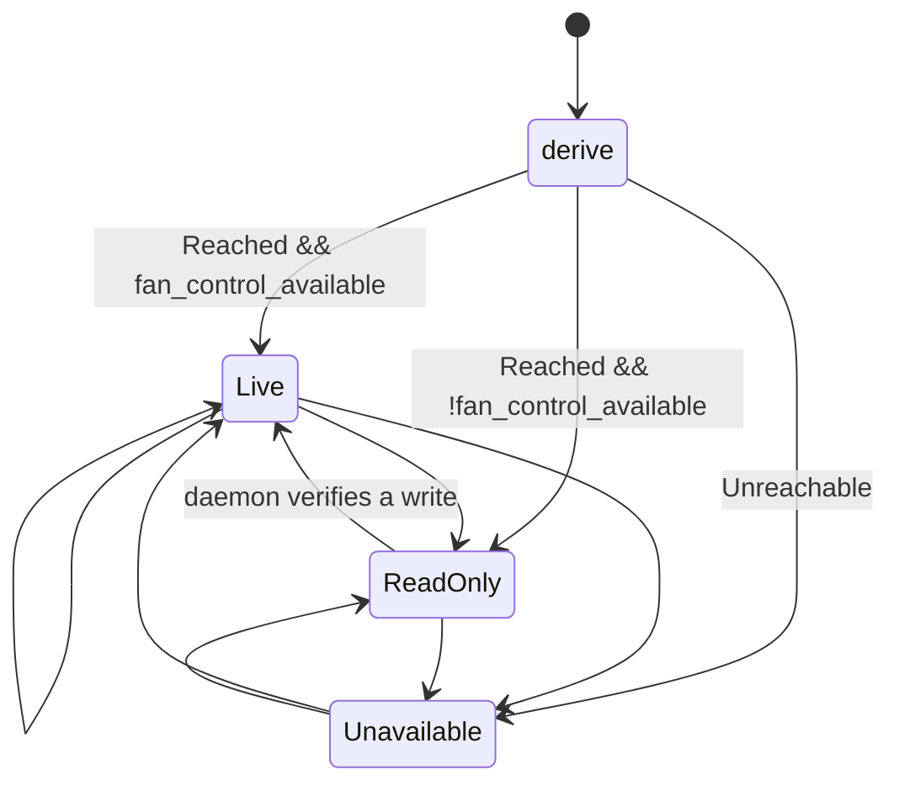

# Data Model: 002-desktop-ui-menubar

This feature introduces **no persisted data and no daemon-side state**. It adds
a read model for the UI and one pure derivation. The wire types
(`Request`/`Response`/`Status`) are feature 001's, unchanged.

---

## Pre-existing wire types (referenced, not changed)

Source: `crates/fand/src/proto.rs`, `crates/smc` — see
[001 contracts/ipc-protocol.md](../001-topfan-complete/contracts/ipc-protocol.md).

### Status *(read model, from daemon)*

| Field | Type | Meaning / validation |
|---|---|---|
| `mode` | `fand::governor::Mode` (`Auto \| Managed \| Full`) | daemon-authoritative; drives every checkmark |
| `hottest_die_c` | `Option<f32>` | `None` ⇒ surfaces render `--` (existing title behaviour) |
| `duty` | `f32` (0…1) | informational |
| `fans` | `Vec<smc::FanState>` | per-fan: `index`, `actual_rpm`, `target_rpm`, `min_rpm`, `max_rpm`, `mode`. **Bounds are per fan and hardware-sourced** — the UI normalizes each gauge against that fan's own `min_rpm…max_rpm` (Constitution III). Empty vec ⇒ title omits the rpm half. |
| `fan_control_available` | `bool` | `false` ⇒ `SurfaceState::ReadOnly` — controls disabled everywhere, live display continues |

### Mode *(user intent)*

`Auto | Managed | Full` — selected in either surface, owned by the daemon. The
UI's four *labels* (Auto/Managed/Full/Off) map onto these three values plus the
"hand back" action reading; the mapping is data in `actions.rs`
(research D3), not a protocol change.

---

## New (UI-side, in `crates/menubar`)

### PollOutcome

Raw result of one poll tick.

| Field/Variant | Invariant |
|---|---|
| `Reached(Status)` | a well-formed `Status` reply was received within the 250 ms timeout |
| `Unreachable(String)` | connect/timeout/decode failure; the string is the reason (for logs) |

No caching, no merging with previous ticks.

### SurfaceState

What each surface renders — **pure function** `derive(PollOutcome) -> SurfaceState`
(in `state.rs`; this is FR-009's seam).

| Variant | Derived from | Rendering obligations |
|---|---|---|
| `Live(Status)` | `Reached && fan_control_available` | full readout; mode controls enabled; checkmark/active-style on the state item matching `status.mode` |
| `ReadOnly(Status)` | `Reached && !fan_control_available` | live temperature/RPM display continues; **all mode controls visibly disabled** with a one-line reason (FR-007); "Open Dashboard" / "Quit" unaffected |
| `Unavailable` | `Unreachable` | distinct unavailable presentation; **no numbers, no stale data** (US3); reads auto-recover on next successful poll; mode controls disabled with CLI fallback hint |

**Transitions** (per tick, unconditional — never sticky):

Rules pinned by tests:

- Derivation has no memory: two identical poll outcomes always yield identical
  `SurfaceState`s (no hysteresis at this layer — the 2 s cadence never makes
  the surfaces flicker-degrade, and honesty outranks cosmetic stability).
- `Unavailable` replaces the last good `Status` entirely (no last-known values
  are rendered).
- Recovery from `Unavailable` happens on the first successful poll with no user
  action (FR-006, SC-004).

### ModeAction *(surface action → command mapping)*

Data table in `actions.rs` (research D3/D4). One row per FR-002 menu item.

| Field | Values |
|---|---|
| `label` | `Auto \| Managed \| Full \| Off \| OpenDashboard \| Quit` |
| `command` | `sudo topfan off` (Auto), `topfan auto` (Managed), `topfan full` (Full), `topfan off` (Off); none for OpenDashboard/Quit |
| `state_item: Option<Mode>` | `Some(Auto)`, `Some(Managed)`, `Some(Full)`, `None` for Off (action-only) and the non-mode items — the checkmark attaches to the state item whose `Mode` equals the polled `status.mode` |

Validation rules (headless-tested):

- Every mode-labelled action maps to exactly one delegated CLI command, and the
  command set is exactly the four existing CLI verbs — no invented commands
  (FR-003: "no second control path").
- For any `Status`, exactly one state item carries the checkmark (or none —
  impossible today since `Mode` is exhaustive).
- `fan_control_available == false` ⇒ every mode action renders disabled in both
  surfaces regardless of `mode`.

### AppInstance

The single running app. Not persisted; exists only while the process runs.

| Aspect | Behaviour |
|---|---|
| ownership | owns both the status item and the dashboard window (FR-008) |
| window state | dashboard open/closed is **transient** — closing the window does not quit the app; reopen shows current poll data immediately (SC-003) |
| single-instance mediation | lock socket `$TMPDIR/topfan-ui.lock`; second launch ⇒ forwards `open-dashboard` and exits |
| exit | `Quit` ends the UI process only; daemon untouched (FR-010, Constitution I) |

### DashboardBridge *(in-window, presentation-only)*

- Inbound: `window.topfan.setStatus(json)` — the serialized `SurfaceState`
  (numbers, mode, availability, per-fan ranges).
- Outbound: `{kind:"mode", value:"auto\|managed\|full\|off"}` message → handed
  to the same `ModeAction` mapping as the menu.
- Held state: sparkline history (bounded ring, per-open), pending-button
  affordance cleared on every `setStatus`. **No authority over any number.**